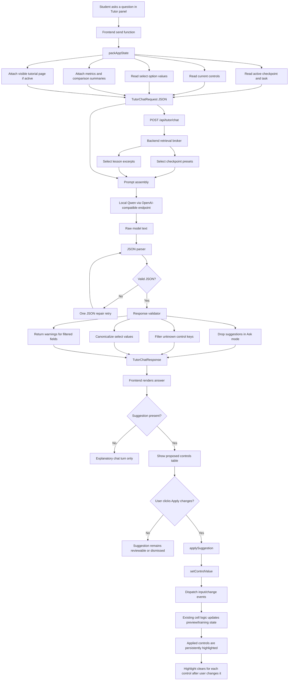

# Changelog - 2026-05-16

## Summary

This note documents the implementation of the **Interactive AI Tutor** for the **PINN Playground** WebUI.

The implementation extends the earlier tutorial and learning-path work with a global, context-aware tutor that can answer questions about the current page, explain the active numerical or PINN task, and, in Agent mode, propose structured parameter changes that the user may review and apply. The tutor is not implemented as an unconstrained chatbot. It is implemented as a small harness with explicit data contracts, bounded retrieval, schema validation, and a controlled frontend apply path.

The principal result is that the WebUI now has:

1. a global tutor panel available from the task-panel area,
2. Ask mode for explanatory responses,
3. Agent mode for structured control suggestions,
4. a FastAPI tutor API with chat, status, and clear endpoints,
5. a local-model integration that defaults to an Ollama-compatible Qwen runner,
6. curated recommendation and lesson-excerpt resources for bounded retrieval,
7. validation logic that rejects unknown controls and invalid select values,
8. a visible-page context mechanism so tutorial-page questions stay grounded in the current chapter,
9. persistent control highlighting after applying an Agent suggestion.

The design objective was to make the AI assistant useful inside the learning workflow while preserving the application's existing educational structure. The model can reason about live state, but the application still controls what state is exposed, what outputs are accepted, and how accepted outputs modify the interface.

---

## Motivation And Design Problem

The previous WebUI iterations established the main learning surfaces: a numerical-method cell, a PINN workspace, diagnostics, and a dedicated PINN tutorial with interactive figures. However, those surfaces still required the student to independently connect four forms of information:

- the active checkpoint and its task requirements,
- the current control settings,
- the plots, metrics, and FEM/PINN comparison state,
- the conceptual tutorial content.

This created two related problems.

First, students could ask useful questions that were strongly contextual, such as "why does this loss dominate?" or "what is this tutorial section saying?" A generic assistant would not know which cell, checkpoint, or tutorial chapter was visible.

Second, students could ask the assistant to change the setup. That requires a stronger contract than plain text. If a model says "make the geometry a cross," the application needs a valid internal select value such as `x_brace`, not an arbitrary label such as `cross` or `N.A.`.

The tutor harness was therefore designed around a central principle: **the language model may propose, but the application must mediate**. Live state is compressed before it reaches the model. Model output is required to be JSON. Suggestions are validated before they reach the DOM. The user remains the final actor who applies or dismisses any change.

---

## Implementation Scope

### Backend files

The backend implementation centers on:

- `pinn_playground/backend/tutor.py`
- `pinn_playground/backend/main.py`

The main application now exposes three tutor routes:

- `POST /api/tutor/chat`
- `GET /api/tutor/status`
- `POST /api/tutor/clear`

The chat route accepts a structured request, runs the harness, calls the local model, validates the model output, and returns a typed response. The status route reports the current local runner configuration. The clear route resets server-held session state for the global tutor thread.

### Frontend files

The frontend implementation centers on:

- `pinn_playground/frontend/tutor.js`
- `pinn_playground/frontend/api.js`
- `pinn_playground/frontend/app.js`
- `pinn_playground/frontend/shell.js`
- `pinn_playground/frontend/tutorial-cell.js`
- `pinn_playground/frontend/style.css`

The tutor is mounted once during application bootstrap. It reads live state at send time rather than storing a stale snapshot. This is important because the same conversation can move across the numerical cell, tutorial cell, and PINN cell.

### Configuration files

Two bounded resource files were added for retrieval:

- `pinn_playground/config/tutor_recommendations.json`
- `pinn_playground/config/tutor_lesson_excerpts.json`

These files are deliberately small. They give the model a curated set of presets and teaching concepts without giving it direct filesystem access or a large unbounded documentation context.

---

## Harness Architecture

The tutor harness is organized as a sequence of auditable transformations. Each stage has a narrow responsibility.

### Stage 1 - Frontend State Packing

The frontend constructs a compact `appState` object immediately before sending a tutor request.

The state packer includes:

- active cell id,
- active checkpoint id,
- checkpoint title and subtitle,
- active task and task progress,
- checkpoint requirements,
- visible tutorial page when the tutorial cell is active,
- current controls,
- available select options,
- summarized metrics,
- FEM baseline availability,
- comparison availability,
- teacher-unlock state,
- low-priority workspace notes when relevant.

Raw plot arrays are not sent. The model receives summaries rather than full numerical fields. This keeps prompts short and reduces the risk that a model answer depends on uninterpreted data.

The visible-page mechanism is especially important. When the user is reading the tutorial, `tutorial-cell.js` publishes the active section into `runtimeState.tutorial`. The tutor then sends this as:

```json
{
  "visiblePage": {
    "kind": "tutorial",
    "title": "PINN Tutorial Notes",
    "sectionId": "section-1",
    "sectionTitle": "1. Computing Parameters Of A Known Function",
    "sectionIndex": 1,
    "sectionCount": 8,
    "introText": "...",
    "bodyText": "..."
  }
}
```

This prevents a question such as "explain what this tutorial notes is about" from being answered using stale PINN preview notes.

### Stage 2 - Bounded Retrieval

The backend retrieval broker selects only a small amount of server-side context.

For recommendations, `_select_presets()` returns presets whose `checkpointIds` include the active checkpoint. If no checkpoint-specific preset matches, tutorial-only checkpoints receive no unrelated fallback presets. This avoids irrelevant control advice leaking into tutorial questions.

For teaching concepts, `_select_lesson_excerpts()` scores curated lesson excerpts by active checkpoint, active cell, and question keywords. The model receives only the matched excerpts, not the full library.

### Stage 3 - Prompt Assembly

The backend builds a system prompt and one user prompt. The system prompt defines:

- the tutor's role,
- Ask mode versus Agent mode,
- JSON-only output requirements,
- rules for suggestions,
- rules for citations,
- visible-page context discipline.

The final prompt contains:

- a `/think` or `/no_think` directive,
- the current mode,
- the summarized live app state,
- curated lesson excerpts,
- curated presets,
- recent conversation history,
- the current student question.

The `thinkMode` toggle exists because the local Qwen model can spend substantial time in extended reasoning. By default, the frontend sends `thinkMode: false`, which maps to `/no_think`. The user can toggle thinking on when a deeper answer is worth the latency.

### Stage 4 - Local Model Call

The model client uses an OpenAI-compatible chat-completions endpoint. The default endpoint is:

- `http://localhost:11434/v1/chat/completions`

This corresponds to Ollama's OpenAI-compatible API. The model selector checks for locally installed Qwen candidates and currently supports:

- `qwen3.6:27b`
- `qwen3:30b-a3b`
- `qwen3:32b`
- `qwen2.5:32b`

The exact local model installed and verified during implementation was:

- `qwen3.6:27b`

The harness remains runner-agnostic as long as the runner exposes an OpenAI-compatible chat-completions endpoint.

### Stage 5 - Response Parsing And Validation

The model is required to return one JSON object matching the `TutorChatResponse` schema.

The backend parser tolerates common model mistakes, including fenced JSON and stray `<think>` blocks. If parsing fails, the backend retries once with a corrective JSON-only instruction.

The validator then applies policy-level constraints:

- in Ask mode, suggestions are discarded,
- in Agent mode, suggestions are allowed only if their control keys are known,
- select/dropdown values must match the available option values,
- known select synonyms are canonicalized, for example `cross` maps to `x_brace`,
- unknown control keys are dropped,
- invalid select values are dropped,
- warnings are returned when a suggestion is filtered.

This validation layer is what separates a language-model proposal from an application action.

### Stage 6 - Frontend Rendering And Optional Apply

The frontend renders the tutor response as a chat turn. In Ask mode, the turn is explanatory only. In Agent mode, the response may include a suggestion card with proposed control changes.

The frontend does not apply suggestions automatically. The user must click **Apply changes**. At that point, `applySuggestion()` iterates through the suggested controls and calls `setControlValue()` for each key-value pair.

The apply path maps camelCase control keys to DOM ids, handles PINN and FEM prefixes, canonicalizes select values again as a second line of defense, dispatches `input` and `change` events, and lets the existing cell logic react as though the user had changed the controls manually.

---

## Structured Agent-Mode Data Flow

The following flow chart summarizes how the Agent receives structured state and how its structured output becomes a user-approved UI update.



The important design feature is that the model does not directly mutate application state. It returns a structured proposal. The backend validates that proposal. The frontend presents it. The user approves it. The existing control event system then performs the actual state transition.

---

## Request And Response Contracts

### Request structure

The frontend sends a `TutorChatRequest` with the following conceptual structure:

```json
{
  "sessionId": "global",
  "mode": "ask",
  "thinkMode": false,
  "message": "What should I try next?",
  "history": [
    { "role": "user", "content": "..." },
    { "role": "assistant", "content": "..." }
  ],
  "appState": {
    "activeCellId": "pinn",
    "activeCheckpointId": "pinn-session",
    "controls": { "nDomain": "900", "nBoundary": "160" },
    "controlOptions": {
      "geometry": [
        { "value": "base", "label": "Base Frame" },
        { "value": "diagonal", "label": "Single Diagonal" },
        { "value": "x_brace", "label": "X-Brace" }
      ]
    },
    "metricsSummary": { "total_loss": 0.23 },
    "visiblePage": { "kind": "workspace", "title": "PINN Workspace" }
  }
}
```

The critical feature is that `controlOptions` travels with the request. This allows the backend to instruct the model to use exact select values and gives the validator enough information to reject or canonicalize invalid dropdown suggestions.

### Response structure

The model must return a `TutorChatResponse`-compatible object:

```json
{
  "message": "The boundary loss is currently larger than the PDE loss, so the model is probably struggling with support or traction enforcement.",
  "suggestion": {
    "rationale": "Increase boundary emphasis while keeping the rest of the setup stable.",
    "controls": { "bcWeight": "7.0" },
    "highlightKeys": ["bcWeight"]
  },
  "citations": [
    { "type": "lesson", "id": "pde-vs-bc-loss", "summary": "Boundary loss indicates enforcement quality." }
  ],
  "warnings": []
}
```

In Ask mode, `suggestion` must be `null`. In Agent mode, the suggestion may still be `null` if the state does not justify a safe change.

---

## Frontend Agent Application Mechanism

Agent mode is intentionally implemented as a review-and-apply loop rather than direct automation.

When a suggestion arrives, the frontend renders a table with:

- control key,
- current value,
- proposed value.

If the user applies the suggestion, the frontend:

1. looks up the DOM control from the control key,
2. resolves the key against PINN and FEM id prefixes,
3. handles special id mappings such as `samplingStrategy` to `adaptive-sampling`,
4. canonicalizes select values against the live `<select>` options,
5. assigns the new value,
6. dispatches `input` and `change` events,
7. stores the applied values for highlight tracking.

This means Agent-mode changes reuse the same reactive path as ordinary user edits. The model does not bypass cell-specific logic, preview scheduling, task progress updates, or shared structural-control synchronization.

The persistent highlight system then marks controls changed by the Agent. Highlights remain visible while the applied value still matches the suggested value. If the student edits one of those controls manually, the highlight for that control disappears. This gives the student a visible record of what the Agent changed without treating the Agent's output as permanent or privileged.

---

## Context Discipline For Tutorial Pages

One bug discovered during testing was that a user could ask:

> explain what this tutorial notes is about

while reading chapter 1 of the tutorial, and the tutor would answer using a stale workspace note:

> Last PINN preview: n_domain=900, n_boundary=160

The cause was architectural rather than linguistic. The tutor request included low-priority workspace notes, but it did not include the currently visible tutorial section. The model therefore selected the only explicit "note" it saw.

The fix added a visible-page contract:

- `tutorial-cell.js` publishes the active tutorial section into `runtimeState.tutorial`,
- `tutor.js` includes that section as `appState.visiblePage`,
- `tutor.py` summarizes `visiblePage` before lower-priority notes,
- the system prompt instructs the model to answer deictic questions from `visiblePage` first,
- stale FEM/PINN notes are not sent while the tutorial cell is active,
- unmatched presets are not sent to tutorial-only checkpoints.

This changed the tutor from a general workspace-state assistant into a page-aware tutor. The distinction matters because educational questions are often indexical: "this page," "this chapter," and "these notes" only make sense relative to the student's current view.

---

## Local Model Integration

The tutor is designed for local use and defaults to Ollama's OpenAI-compatible API. No new Python dependency was required.

The status endpoint reports:

- whether stub mode is active,
- the endpoint used for chat completions,
- the selected model,
- the candidate Qwen models,
- locally available Ollama models,
- readiness.

The implementation was validated with:

- model: `qwen3.6:27b`,
- endpoint: `http://localhost:11434/v1/chat/completions`,
- app server: `http://127.0.0.1:8000`.

The harness can be redirected by environment variables:

- `TUTOR_API_BASE`,
- `TUTOR_MODEL`,
- `TUTOR_API_KEY`,
- `TUTOR_TIMEOUT`,
- `TUTOR_STUB`,
- `TUTOR_RECOMMENDATIONS_PATH`,
- `TUTOR_LESSON_EXCERPTS_PATH`.

This keeps the tutor portable across Ollama, vLLM, llama.cpp server, or another OpenAI-compatible local runner.

---

## User Interface Integration

The tutor appears as a launcher above the task panel. This placement was chosen because the task panel already describes what the student is trying to accomplish. The tutor therefore reads as assistance for the current learning step rather than as a separate application feature.

The tutor panel includes:

- context label,
- local model status,
- Ask and Agent mode switch,
- Think Off / Think On toggle,
- Clear Chat action,
- conversation thread,
- composer,
- suggestion cards in Agent mode,
- citations and warnings as expandable details.

The context label updates when checkpoints change and when tutorial sections change. For example, while the student reads the first tutorial section, the label can indicate:

- `Tutorial Cell - 1. Computing Parameters Of A Known Function`

This is a small but important transparency feature. It tells the student what the tutor will treat as the current context before they ask a question.

---

## Validation And Observed Behavior

The implementation was validated through syntax checks, backend compilation, JSON resource validation, prompt-construction checks, and live API smoke tests.

Verified checks included:

- frontend syntax checks with `node --check`,
- backend compilation with `uv run python -m compileall`,
- JSON config validation,
- whitespace validation with `git diff --check`,
- live status endpoint response,
- live Ask-mode tutor request,
- live Agent-mode tutor request,
- geometry canonicalization from `cross` to `x_brace`,
- think-mode off/on request behavior,
- tutorial-context answer with stale `n_domain` notes present.

The tutorial-context test is particularly important. A request was constructed with:

- `activeCellId: pinnTutorial`,
- `activeCheckpointId: pinn-tutorial`,
- visible chapter 1 tutorial text,
- a stale note containing `n_domain=900` and `n_boundary=160`.

After the visible-page fix, the live tutor answered about chapter 1's quadratic-parameter discussion rather than the stale PINN preview note.

One limitation remains in the development environment: the browser automation sandbox could not reliably connect to `127.0.0.1:8000`, even while terminal HTTP checks showed the server was reachable. For that reason, live validation used terminal HTTP requests rather than browser-tool DOM inspection.

---

## Current Status

Working in the staged changes:

- the WebUI has a global tutor panel,
- the tutor can operate in Ask or Agent mode,
- the backend harness receives structured state and returns structured responses,
- local Qwen via Ollama is installed and reachable,
- the model can propose parameter changes without directly mutating state,
- backend validation filters unsafe or invalid suggestions,
- frontend apply logic converts accepted suggestions into ordinary DOM control events,
- applied suggestions are visibly highlighted,
- tutorial questions are constrained to the active tutorial page.

Most important implementation implication:

- **the PINN Playground now has an AI tutor that is integrated into the learning workflow as a controlled state-aware system, not as an unconstrained chat overlay**.

---

## Next Stage

The next useful stage is not to expand the model's autonomy. It is to evaluate the educational quality of the tutor in student-like sessions.

Recommended next steps:

1. Run a manual browser walkthrough across the numerical cell, tutorial cell, and PINN workspace.
2. Record examples where Ask-mode answers are too broad, too terse, or too detached from the visible task.
3. Add more curated lesson excerpts only where repeated user questions show a real gap.
4. Add more preset recommendations only when a control intervention is pedagogically justified.
5. Consider saving anonymized tutor interaction traces for teaching evaluation, if privacy constraints are defined first.
6. Revisit whether long-running Agent suggestions should include a preview-before-apply mechanism for higher-risk parameter groups.

The harness is now sufficiently structured for that next evaluation phase. The remaining question is less about whether the model can communicate with the app, and more about whether its guidance consistently improves student reasoning.