# Exercise 1-3 Report

## Box-Cylinder Union Formulation and Results

The second task constructs the union of a box and a cylinder using implicit fields. In the current implementation, the fields follow a positive-inside convention, so points inside a solid have positive field values and the boundary is given by the zero isosurface.

The box has side length $1$ along the $x$-, $y$-, and $z$-directions and is centered at the origin. Its implicit field is

$$
f_b(x, y, z) = 0.5 - \max(|x|, |y|, |z|).
$$

This is positive inside the box, zero on the faces, and negative outside.

The cylinder is aligned with the $z$-axis and has radius $0.1$. In the current script it is embedded slightly into the cube to make the R-function smoothing easier to observe. Its lower end is at $z = 0.45$ and its upper end is at $z = 0.7$, so $0.05$ of the cylinder is buried inside the box and the exposed height above the box is exactly $0.2$. For the hard min/max construction, the cylinder field is written as

$$
f_c(x, y, z) = \min\left(0.1 - \sqrt{x^2 + y^2},\ z - 0.45,\ 0.7 - z\right).
$$

The first Boolean construction is the standard min/max union,

$$
f_{\text{union,minmax}}(x, y, z) = \max\left(f_b(x, y, z), f_c(x, y, z)\right).
$$

Because the implementation uses positive-inside fields, the union is obtained with $\max$: a point belongs to the combined solid when it lies inside either primitive. This produces the correct geometry, but the junction between the box and the cylinder remains relatively sharp because the min/max operator preserves a piecewise transition.

The second Boolean construction uses an R-function union. With the same positive-inside convention, the implemented form is

$$
f_{\text{union,R}}(x, y, z) = f_b(x, y, z) + f_c(x, y, z) + \sqrt{f_b(x, y, z)^2 + f_c(x, y, z)^2 - 2\alpha f_b(x, y, z) f_c(x, y, z)}.
$$

Here $\alpha \in [0,1]$ controls the blending behavior. Smaller values of $\alpha$ create a softer and more rounded transition near the box-cylinder junction, while values closer to $1$ recover a sharper interface that approaches the min/max result.

For visualization, the implicit surface is extracted from sampled 3D volume data with marching cubes. In the union task, the current implementation uses the slightly negative level

$$
f(x, y, z) = -0.01
$$

instead of exactly zero so that the smoothed transition introduced by the R-function is more visible in the rendered surface.

## Metamorphosis Formulation

The sphere is defined implicitly by

$$
f_s(x, y, z) = 1 - (x^2 + y^2 + z^2).
$$

The box is defined by

$$
f_b(x, y, z) = 0.5 - \max(|x|, |y|, |z|).
$$

The cylinder used in the target model has radius $0.1$, extends from $z = 0.45$ to $z = 0.7$, and is composed with min/max Boolean operations:

$$
f_c(x, y, z) = \min\left(0.1 - \sqrt{x^2 + y^2},\ z - 0.45,\ 0.7 - z\right).
$$

The target box-cylinder model is the min/max union

$$
f_u(x, y, z) = \max(f_b(x, y, z), f_c(x, y, z)).
$$

The 10-step linear metamorphosis is defined by

$$
f_\mu(x, y, z) = (1 - \mu) f_s(x, y, z) + \mu f_u(x, y, z), \quad \mu = \frac{i}{10}, \ i = 0, 1, \ldots, 10.
$$

For each value of $\mu$, the implicit surface is visualized as the isosurface

$$
f_\mu(x, y, z) = 0.
$$

## Results

Generated with marching cubes on a $60 \times 60 \times 60$ volume grid. The sequence contains 11 screenshots: the sphere, 9 intermediate shapes, and the final min/max box-cylinder model.

| Step | $\mu$ | Vertices | Faces |
| --- | --- | ---: | ---: |
| 0 | 0.0 | 7344 | 14684 |
| 1 | 0.1 | 7016 | 14028 |
| 2 | 0.2 | 6656 | 13308 |
| 3 | 0.3 | 6344 | 12684 |
| 4 | 0.4 | 5848 | 11692 |
| 5 | 0.5 | 5384 | 10764 |
| 6 | 0.6 | 4888 | 9772 |
| 7 | 0.7 | 4304 | 8604 |
| 8 | 0.8 | 3760 | 7516 |
| 9 | 0.9 | 3000 | 5996 |
| 10 | 1.0 | 2464 | 4924 |

### Step 0, $\mu = 0.0$

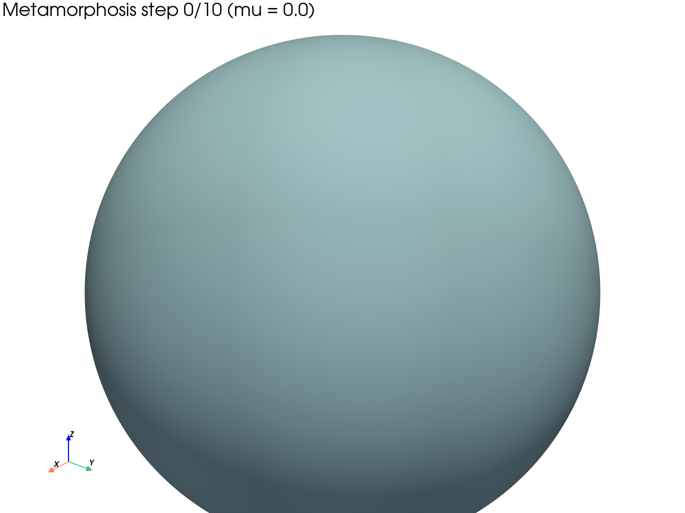

### Step 1, $\mu = 0.1$

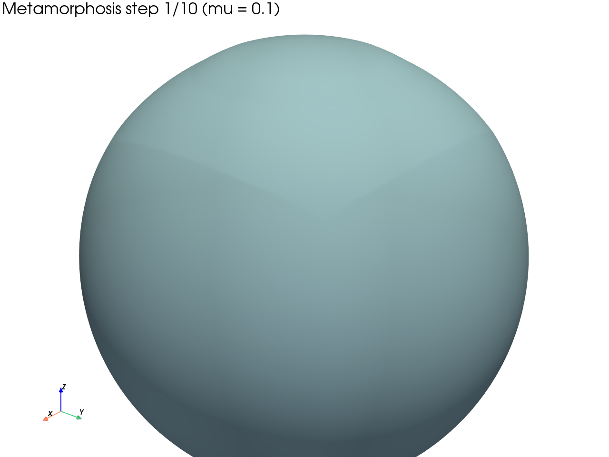

### Step 2, $\mu = 0.2$

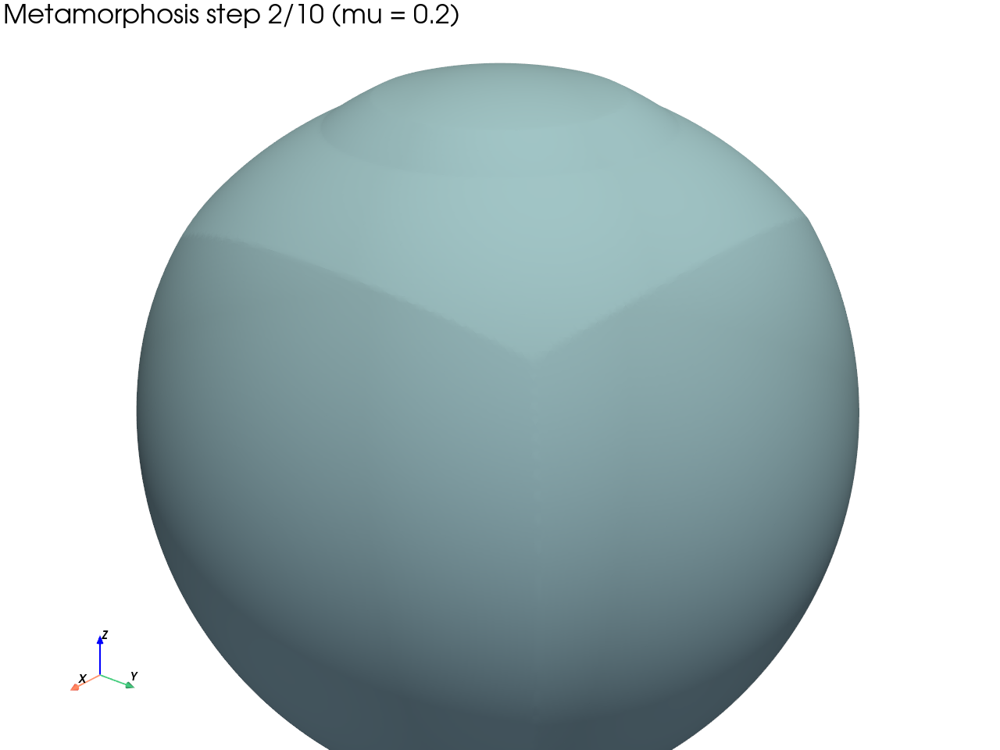

### Step 3, $\mu = 0.3$

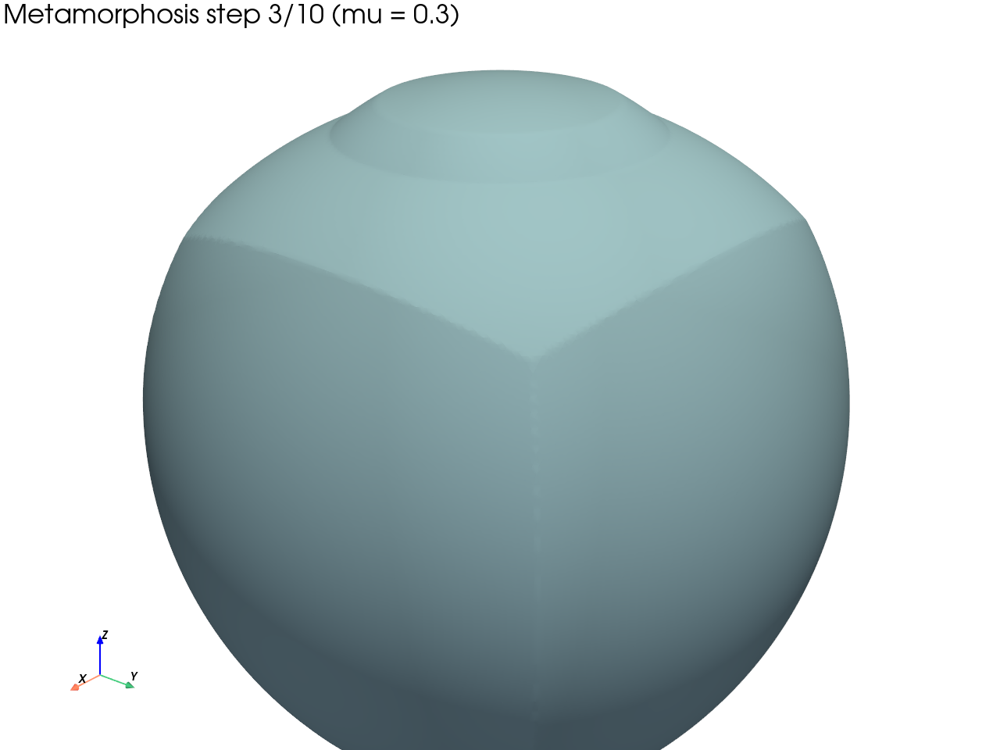

### Step 4, $\mu = 0.4$

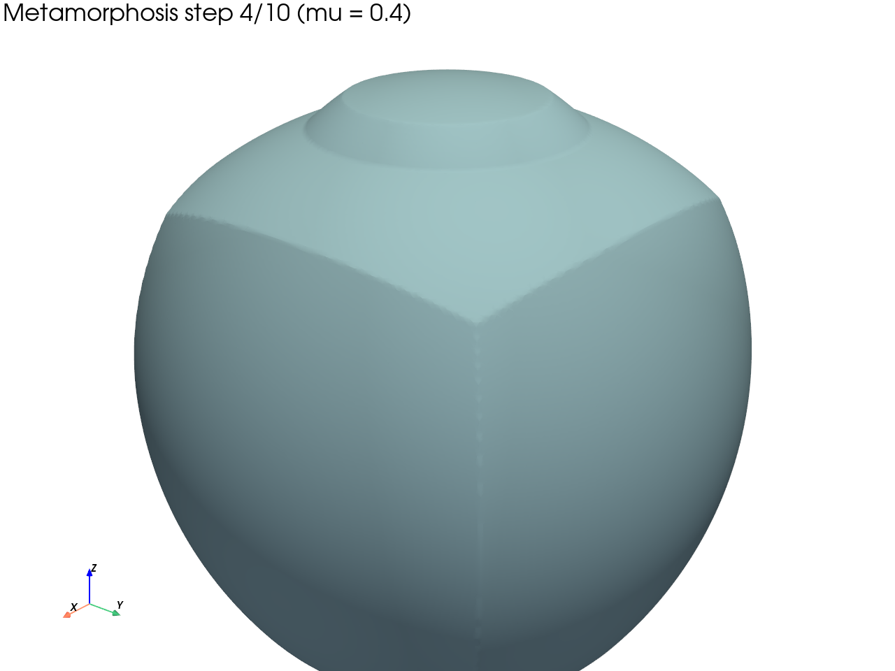

### Step 5, $\mu = 0.5$

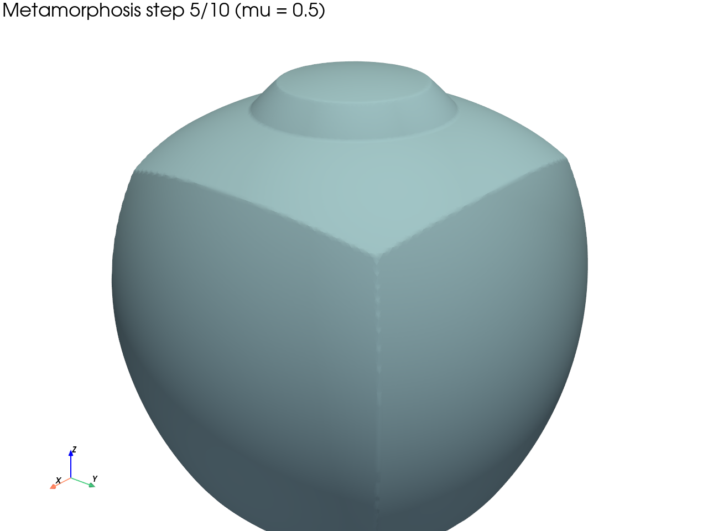

### Step 6, $\mu = 0.6$

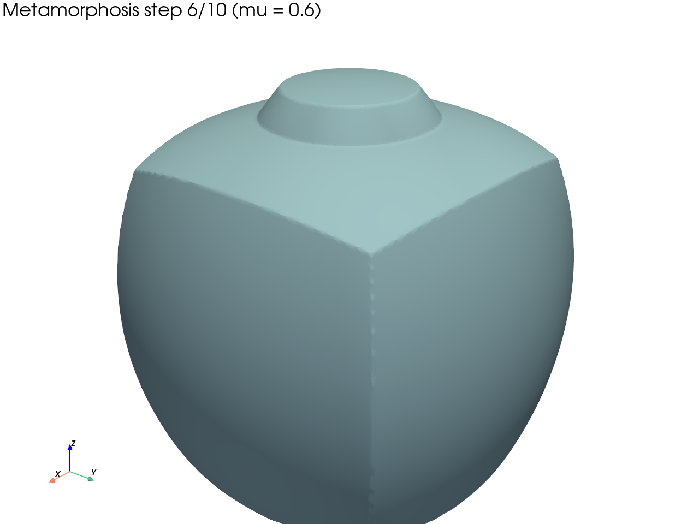

### Step 7, $\mu = 0.7$

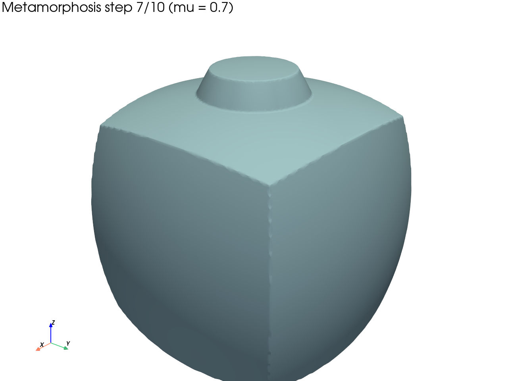

### Step 8, $\mu = 0.8$

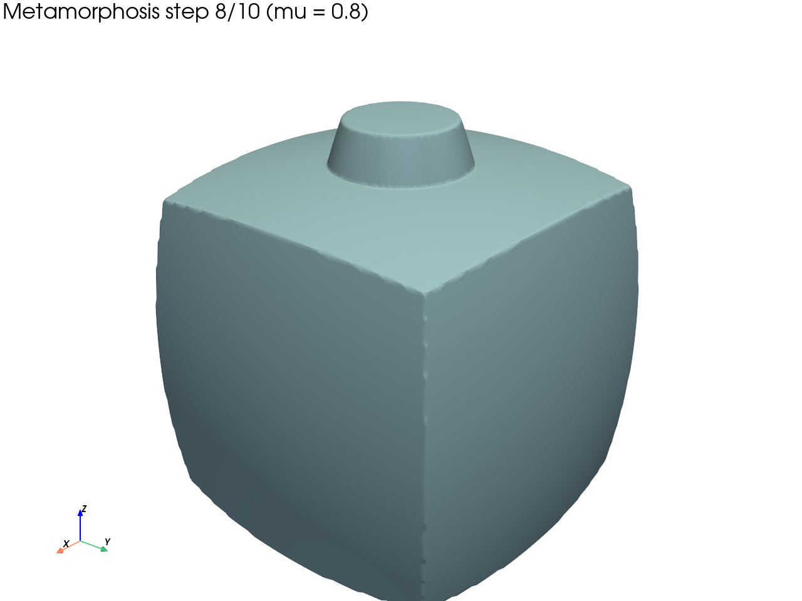

### Step 9, $\mu = 0.9$

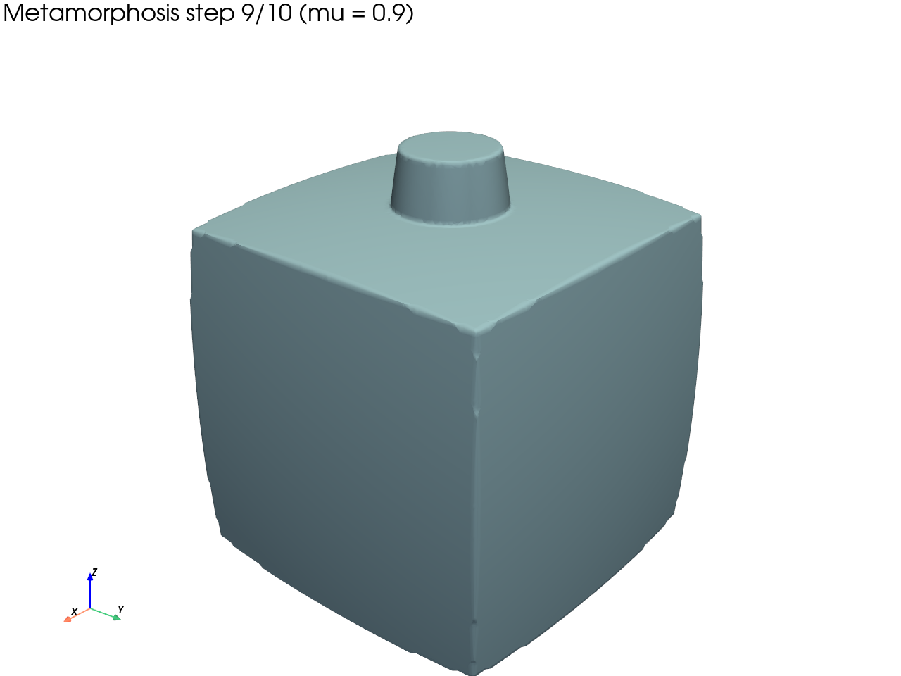

### Step 10, $\mu = 1.0$

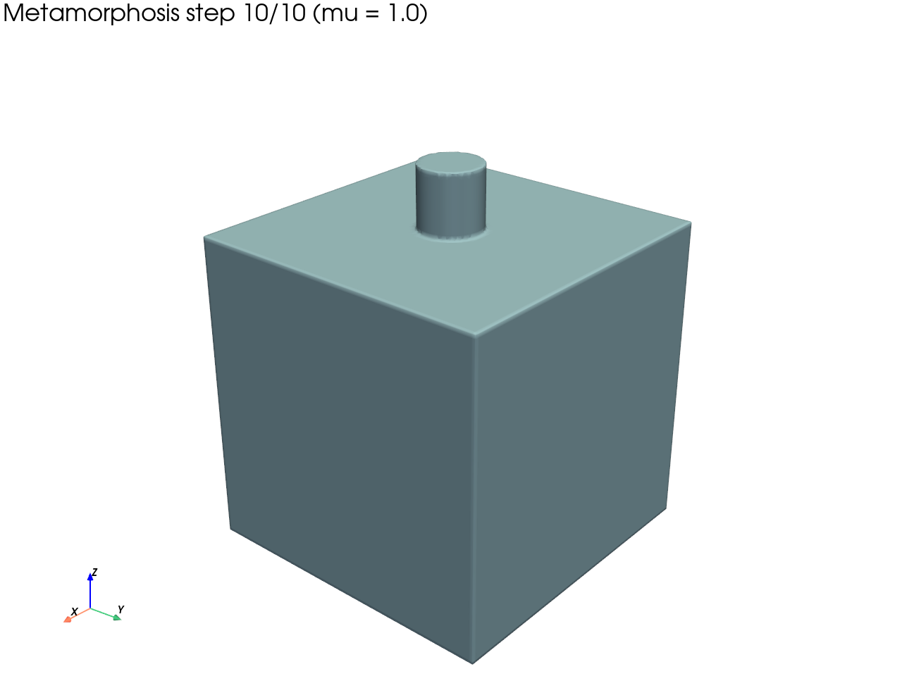